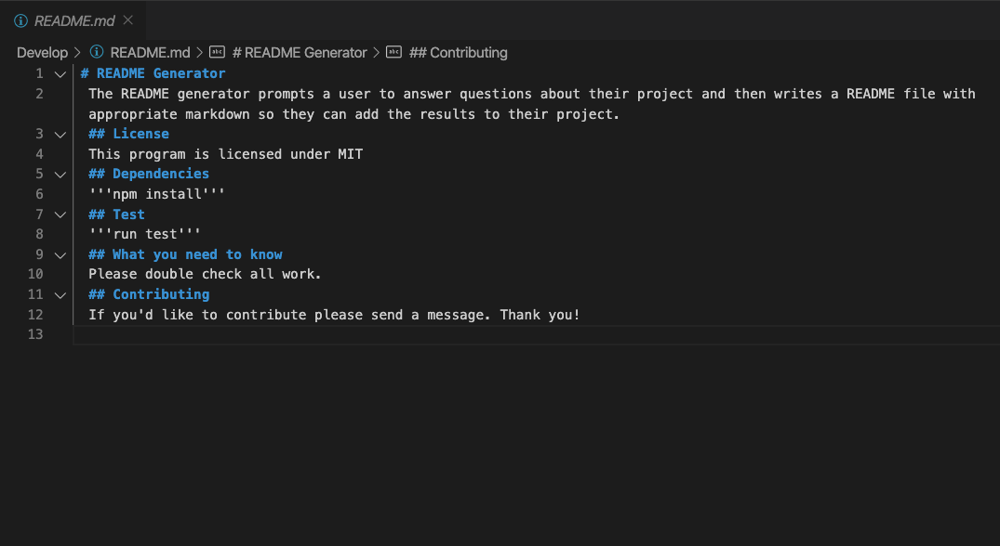

# Readme-Generator

## About

The Readme generator is a nodejs command line program. When a user runs the program they are prompted to answer questions about their project. The answers are then passed in to a markdown generator function which will format the answers appropriately. Lastly a write file function is executed which creates the readme.md file.

Please find the readme.md file written from the program in the utils folder.

## Demo

[Click HERE for a video Demo](https://drive.google.com/file/d/1YHQZzAUbPE5sLQhTFkcCNnXGkMO29ITe/view)

